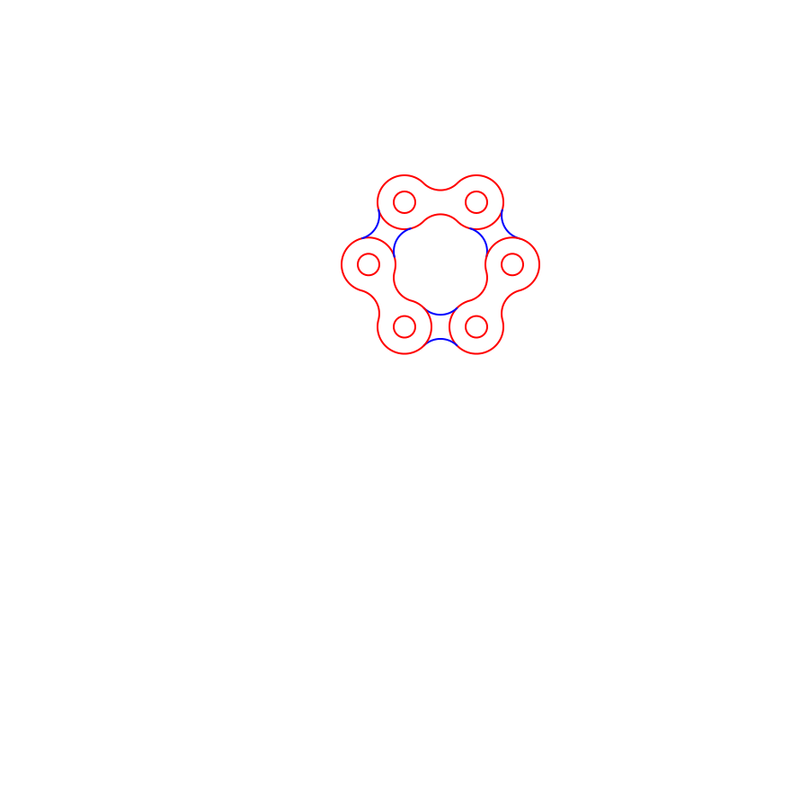
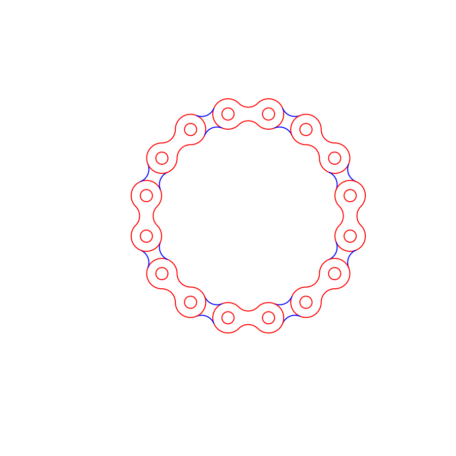
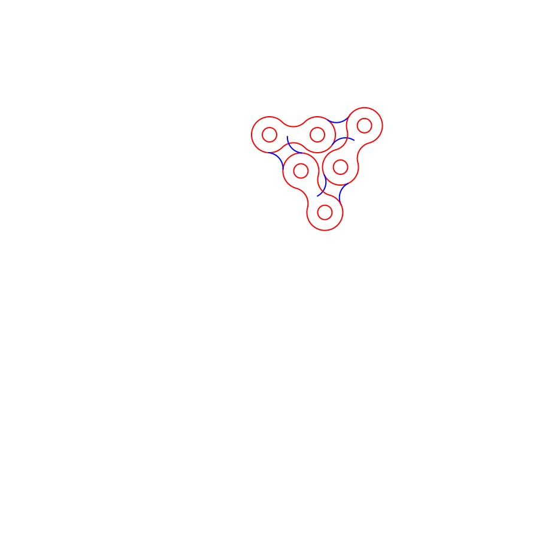
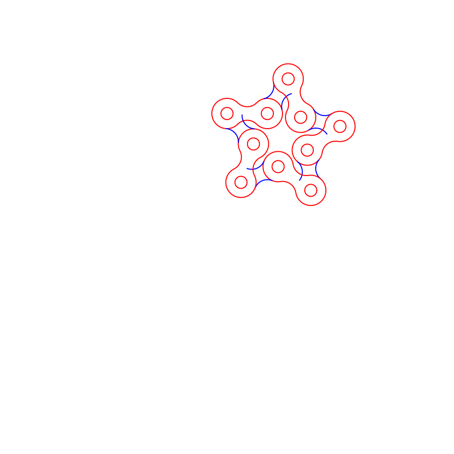
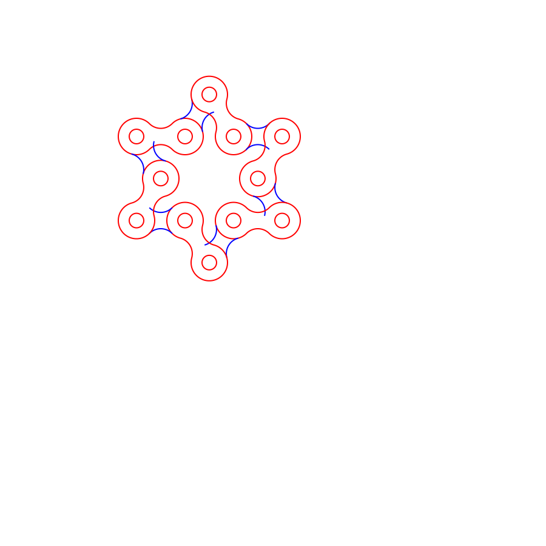
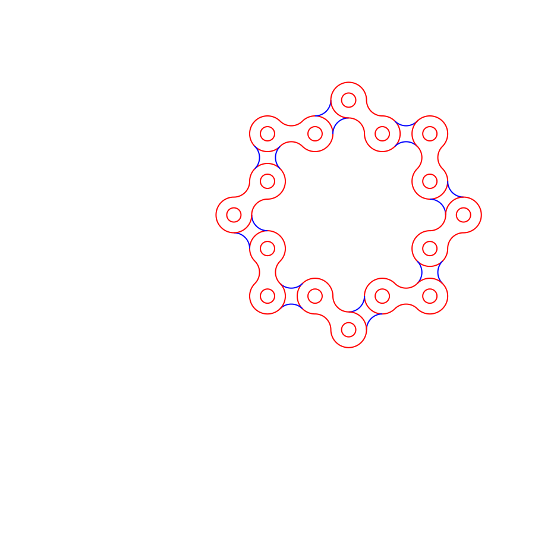

# bike_chain_drawing
Parametric drawing of a bike chain

Regular ring with 6 links:

Regular ring with 16 links:

Regular 3-pointed star:

Regular 5-pointed star:

Regular 6-pointed star:

Regular 8-pointed star:

