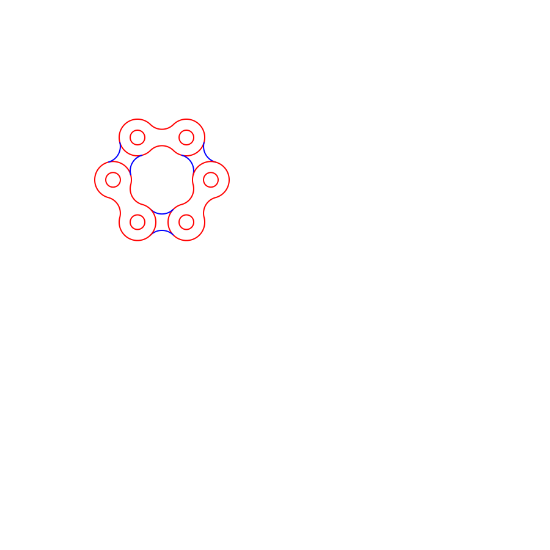
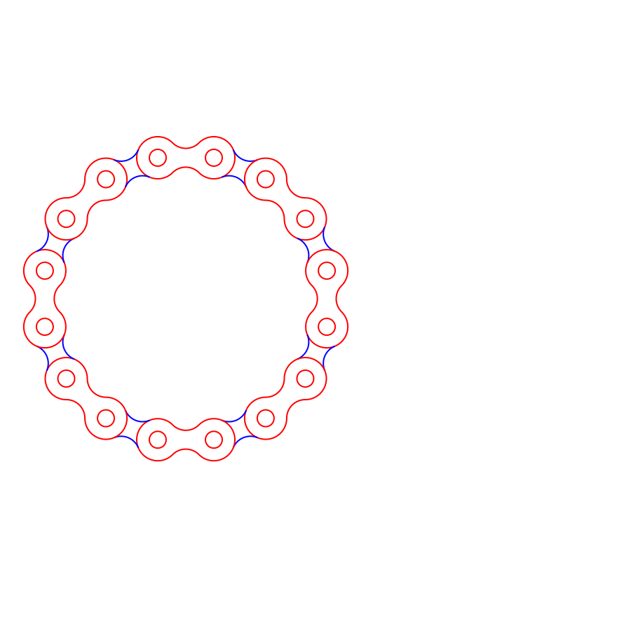
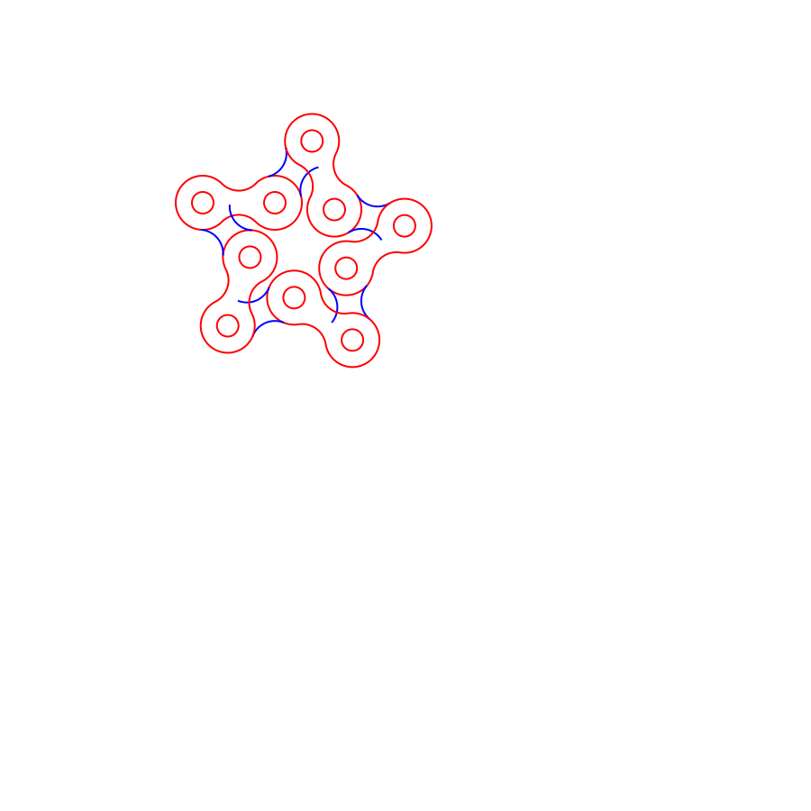

# bike_chain_drawing
Parametric drawing of a bike chain

Regular hexagon:

Regular frequency 3 hexagon:

Regular 16-sided polygon:

Regular 3-pointed star:

Regular 5-pointed star:

Regular 5-pointed frequency 2 star:

Regular 6-pointed star:

Regular 8-pointed star:

